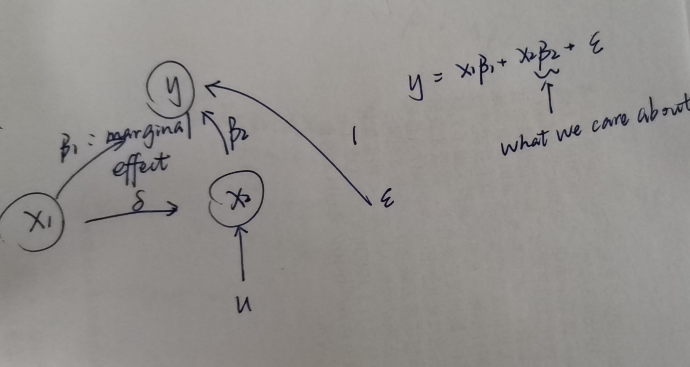

# Econometrics by Prof. Ju

* 前半学期都在讲高级概率论的知识；然后再讲微观计量，不讲时间序列与financial econometrics

## 经济学是科学吗？

经济学的研究过程：先看到observation/data，回去找economic theory去解释现实。

## Chapter 1: Introduction to Probability

### Probability Space

$(\Omega,\mathcal{F},\bold{P})$ is the triple.

$\Omega$: sample space; $\Omega = \{\omega|\omega$ *is a potential outcome of a random experiment*$\}$.

Event $E$ is a collection of possible outcomes of an experiment $\Omega$.

Occurrence: An event $E$ occurs $\Leftrightarrow$ The realized outcome $\omega$ belongs to $E$.

#### $\sigma-field$

1. $\Omega\in \mathcal F$
2. $E\in \mathcal F$ implies $E^C \in \mathcal F.$ That is, $\mathcal F$ is closed under complement.
3. $E_1, E_2, ...\in \mathcal F$ implies $\bigcup^\infty_{n=1} E_n\in \mathcal F$.

#### $\sigma-field$ generation

If $\pi\subset 2^\Omega, $ $\sigma(\pi)$ is the smallest $\sigma-field$ that contains $\pi$.

$B(R) = \sigma(\{open$ $ sets\})$: *Borel*

$\{(-\infty,x]|x\in R\}$ is not closed under countable union, but we can generate a $\sigma-field$ based on it $\Rightarrow$ $\sigma(\{(-\infty,x]|x\in R\})$

#### Theorem 1.1

$B(R) = \sigma(\{(-\infty,x]|x\in R\})$... to be proved as homework.

Hint:

* If $\pi_1$ and $\pi_2$ are $\sigma-field$, then $\pi_1 \cap \pi_2$ is also a $\sigma-field$;
* If $\pi_1\subset \pi_2$, then $\sigma(\pi_1)\subset\sigma(\pi_2)$.

#### Probability Measure

A set function $\bold P$ on the $\sigma-field$ $\mathcal F$ (domain) is a *probability* or *probability measure* if it satisfies the following conditions:

1. $\bold P(E)\geq0$ for all $E\in \mathcal F$;
2. $\bold P(\Omega)=1$;
3. if $E_1,E_2,...\in \mathcal F$ are disjoint, then $\bold P(\cup^\infty_{n=1}E_n)=\sum^\infty_{n=1}\bold P(E_n)$.

#### Conditional Probability

For an event $F$ such that $P(F)>0$, we define the conditional probability of $E$ given $F$ by
$$
P(E|F)=\frac {P(E\cap F)}{P(F)}
$$

### Limit concepts in probability space

Theorem: When $\{E_n\}$ is monotone, $P(\lim_{n\to \infty}E_n)=\lim_{n\to\infty}P(E_n)$.

从数列的上/下极限引入集合的上/下极限：
$$
\lim_{n\to\infty}\inf a_n=\inf_{n\geq1}\sup_{k\geq n}a_k,\quad \lim_{n\to\infty}\sup a_n=\sup_{n\geq1}\inf_{k\geq n}a_k.
$$
If $\lim_{n\to\infty}\inf a_n=\lim_{n\to\infty}\sup a_n$, we say $\lim_{n\to\infty}a_n$ exists.

Likely in probability space,
$$
\lim_{n\to\infty}\sup E_n=\cap^\infty_{n\geq1}\cup^\infty_{k\geq n}E_k,\quad \lim_{n\to\infty}\inf E_n=\cup^\infty_{n\geq1}\cap^\infty_{k\geq n}E_k.
$$

Explanation:
$$
\omega\in\lim_{n\to\infty}\sup E_n\quad\Leftrightarrow\quad \forall n,\omega\in B_n(=\cup^\infty_{k=n}E_k)\quad\Leftrightarrow\quad\forall n,\exist k\geq n,s.t. \omega\in E_k, \\
\lim_{n\to\infty}\sup E_n=\{\omega|\omega\in E_n,\quad i.o. \}
$$

$$
\omega\in\lim_{n\to\infty}\inf E_n\quad\Leftrightarrow\quad \exist n,\omega\in A_n(=\cap^\infty_{k=n}E_k)\quad\Leftrightarrow\quad\exist n,\forall k\geq n,s.t. \omega\in E_k, \\
\lim_{n\to\infty}\inf E_n=\{\omega|\omega\in E_n,\quad ev. \}
$$

Obviously, $\lim_{n\to\infty}\inf E_n \subset \lim_{n\to\infty}\sup E_n$.

If $\lim_{n\to\infty}\inf E_n=\lim_{n\to\infty}\sup E_n$, we say $\lim_{n\to\infty}E_n$ exists.

E.g. $\{E_n\}:A,B,A,B,...$ The limit of $\{E_n\}$ does not exist.
$$
\lim \sup E_n = A\cup B, \quad \lim \inf E_n = A\cap B.
$$

#### Borel-Cantelli lemma

$$
\sum^\infty_{n=1}\bold P(E_n)<\infty\quad\Rightarrow\quad \bold P(\lim\sup E_n)=0
$$

Analogy: $\forall n, a_n\geq0,\sum^\infty_{n=1}a_n<\infty\quad\Rightarrow\quad\lim a_n=0$.

#### $\pi-$ and $\lambda-$ systems

$\pi-$system: $E,F\in\mathcal P$ implies $E\cap F\in\mathcal P$.

$\lambda-$ system:

* $\Omega\in\mathcal L$;
* If $E,F\in \mathcal L$ and $E\subset F$, then $F-E\in \mathcal L$;
* If $E_1,E_2,...\in \mathcal L$ and $E_n\uparrow E$, then $E\in \mathcal L$.

Theorem: A class $\mathcal F$ of subsets of $\Omega$ is a $\sigma-field$ $\Leftrightarrow$ $\mathcal F$ is both a $\pi-$ and $\lambda-$ system.

#### Definition 1.1

$\sigma(S)$: the smallest $\sigma-field$ that contains $S$;

$\pi(S)$: the smallest $\pi-$ system that contains $S$;

$\lambda(S)$: the smallest $\lambda-$ system that contains $S$.

#### Dynkin’s Lemma: Let $\mathcal P$ be a $\pi-$system. Then $\lambda(\mathcal P)=\sigma(\mathcal P)$

## Chapter 2: Random Variables, Distributions and Densities

$(\Omega,\mathcal F,\mathcal P)\quad \rightarrow\quad (R,\mathcal B(R),P_X)\quad or\quad (R^n,\mathcal B(R^n),P_X)$

Definition 2.1: A *random variable* $X$ is a *measurable function* from $\Omega$ to $\bold R$, i.e., it assigns a number to each outcome: $X=X(\omega)$.

### Transformation of a random variable: ($Y = f(X(\omega))$)

$$
(\Omega,\mathcal F,\mathcal P)\quad \rightarrow^X \quad (R,\mathcal B(R),P_X)\quad \rightarrow^f (R,\mathcal B(R),P_Y)
$$

Define the distribution of $Y$ to be
$$
\forall A\in \mathcal B(R),\quad P_Y(A)\equiv P_X[f^{-1}(A)]=P[X^{-1}(f^{-1}(A))]
$$

## Chapter 3: Expectations

$$
E(X)=\int XdP = \int X(\omega)dP
$$

​where $X$ here is called *“integrand”*, and $P$ is called *“integrator”*. ---- Lebesque Integral

### Lebesque Integral

直观理解：按照纵轴来积分，
$$
\int fd\mu= \lim\sum^n_{i=1}\xi_i\cdot\mu\{x:y_{i-1}\leq f(x)\leq y_i\}
$$
​ where $\mu$ is the measure (length), $\xi\in[y_{i-1},y_i]$.

Lebesque Integral is a generalization of Riemann Integral, in the sense that Lebesque Integral == Riemann Integral *whenever the latter exists*.

E.g. (Dirichlet $f(\cdot)$)
$$
\int^1_0 f(x)dx = 1\cdot\mu(\{x|f(x)=1\})+0\cdot\mu(\{x|f(x)=0\})\\
=1\cdot 0+0\cdot1=0
$$

* Note: 有理数是可列的，测度为零。

计算方法：

When $f(\cdot)\geq0$ is continuous, we construct a sequence $\{f_n\}\uparrow f$, so that
$$
\int fdP\equiv \lim_{n\to\infty}\int f_n dP,
$$
​ where $\{f_n\}$ is a *simple function*.

More generally, when $f(\cdot)$ is continuous (not necessarily nonnegative), construct
$$
f=f^+-f^-=\max(f(x),0)-\max(-f(x),0)
$$
​ to divide $f(\cdot)$ into positive & negative parts, so that $f^+$ & $f^-$ are both nonnegative.
$$
\Rightarrow\quad \int fdP=\int f^+dP-\int f^-dP
$$
但一般情况下，当对应的黎曼积分存在时，仍然用黎曼积分方法计算更为简单，否则按照上述方法也可计算。

### Transformation of a random variable

$$
Y = f(X(\omega))
$$

$$
E(Y)=E[g(X)]=\int g(X(\omega))dP=\int g(X)dP_X
$$

​所以没必要用$\int g(X(\omega))dP$去计算，完全可以用$\int g(X)dP_X$计算，即进入到$X$的概率空间算，不需要回到$\omega$的概率空间。
$$
dP_X=p(x)\cdot d\mu=p(x)\cdot \mu(dx)=p(x)\cdot dx=dF(x)\\
\Rightarrow \quad \frac {dP_X}{d\mu}=p(x):local\;ratio
$$

$$
E[Y]=E[g(X)]=\int g(X(\omega))dP=\int g(x)dP_X=\int g(x)p(x)d\mu=\int g(x)dF(x)
$$

#### Theorem 3.1: (Random-Nikodym Theorem)

Let $\mu$ and $\nu$ be two nonnegative measures on a measure space $(M,\mathcal M)$. If $\nu$ is *absolutely continuous* with respect to (w.r.t.) $\mu$. That is, $\forall A\in \mathcal M,\nu(A)=0$, whenever $\mu(A)=0$.

Then, $\nu$ can be represented as
$$
\nu(A)=\int_A fd\mu
$$
​ for a measurable nonnegative function $f$ and any set $A\in \mathcal M\quad \Rightarrow\quad fd\mu$

#### Some properties

$$
Cov(X,Y)=E[(X-EX)(Y-EY)^T]=E[XY^T]-E[X](E[Y])^T
$$

$$
Var(X)=Cov(X,X)=E[XX^T]-E[X](E[X])^T
$$

$$
\Rightarrow\quad Cov(AX,BY)=ACov(X,Y)B^T
$$

$$
Var(AX)=AVar(X)A^T
$$

$$
\rho_{X,Y}\equiv corr(X,Y)=\frac {Cov(X,Y)}{\sqrt {Var(X)\cdot Var(Y)}}
$$

#### Properties of Expectation

1. Linearity

2. Monotonicity: $g_1(X)\geq g_2(X)\quad \Rightarrow \quad E(g_1(X))\geq E(g_2(X)) $

3. Chebyshev Inequalities: $P\{|X|\geq \varepsilon\}\leq \frac {E{|X|^k}}{\varepsilon^k},\forall \varepsilon>0$

   * The Inequality gives the upper bound of the probability measure of the tails;

   * $$
     Proof:\qquad\bold 1\{|X|\geq\varepsilon\}\leq \left|\frac X\varepsilon \right|^k\\
     \Rightarrow \quad \bold E[1\{|X|\geq\varepsilon\}]=P(\{|X|\geq\varepsilon\})\leq \frac {E|X|^k}{\varepsilon^k}
     $$

4. Cauchy-Schwartz Inequality

5. Jensen’s Inequality

6. Define k-th moment of $X$ to be $\mu_k\equiv E[X^k]$, k-th central moment $\mu^*_k\equiv E[(X-E[X])^k]$.

   * If $\;0<p<q$, $\mu_q<\infty \Rightarrow \mu_p<\infty $
   * $\mu_k<\infty \Leftrightarrow \mu^*_k<\infty $

### Independence

#### Definition 3.1: Independence between 2 $\sigma-fields$

Suppose $F$ and $G$ are 2 $\sigma-fields$. We say $F$ and $G$ are independent iff $\forall A\in F$ and $\forall B\in G$, $A$ and $B$ are independent.

#### Definition 3.2: $X $ and $Y$ are independent if $\sigma(X)$ and $\sigma(Y)$ are independent

Intuitively, $P(\{X\in A\}|\{Y\in B\})=P(\{X\in A\})$. The information that $Y$ provides no new information for inferring $X$, and vice versa.

#### Theorem 3.2: $X$ and $Y$ are independent $\Leftrightarrow$ $p(x,y)=p(x)\cdot p(y)$

Proof:
$$
X\;and\;Y\;are\;independent\\
\Leftrightarrow \sigma(X)\; and \;\sigma(Y)\; are \;independent\\
\Leftrightarrow \forall A\in\mathcal B(R),\forall B\in\mathcal B(R),P(X^{-1}(A)\cap P(Y^{-1}(B))=P(X^{-1}(A))\cdot P(Y^{-1}(B))
$$
Let $Z=(X,Y)'$
$$
LHS=P(\{\omega|\omega\in X^{-1}(A)\;and\;\omega\in Y^{-1}(B)\})\\
=P(\{\omega|X(\omega)\in A\;and\;Y(\omega)\in B\})\\
=P(\{\omega|Z(\omega)\in A\times B  \})\\
=P(Z^{-1}(A\times B))=P_Z(A\times B)
$$

$$
RHS=P_X(A)\cdot P_Y(B)
$$

$$
\Leftrightarrow\quad \forall A,B\in\mathcal B(R), P_Z(A\times B)=P_X(A)\cdot P_Y(B)
$$

Using the Random-Nikodym Theorem, we have
$$
P_Z(A\times B)=\int\int_{A\times B} p(x,y)\mu(dxdy),\\
P_X(A)=\int_A p(x)\mu(dx),P_Y(B)=\int_B p(y)\mu(dy),
$$
​so
$$
\forall A,B\in\mathcal B(R),\int\int_{A\times B} p(x,y)\mu(dxdy) =\int_A p(x)\mu(dx)\cdot \int_B p(y)\mu(dy)\\
=\int\int_{A\times B}p(x)p(y)\mu(dxdy)\\
\Rightarrow \quad p(x,y)=p(x)\cdot p(y).
$$

* Note: Fubini’s Theorem: a double Integral can be computed using iterated integral

### Conditional Expectation

$$
E(Y|X)=E(Y|\sigma(X))
$$

E.g. $y=g(X)+u$. $g$ and $u$ are unknown, while $y$ and $X$ are observable. We can estimate it using the identification condition $E(u|X)=0$. Then, we have

$$
E(y|X)=E(g(X)|X)+E(u|X)=E(g(X)|\sigma(X))+0=g(X).
$$

## Chapter 6: Asymptotic Theory

### Convergence of a R.V. sequence

* From frequency to probability...

* R.V.本身也是$\omega$的函数，考虑R.V.的收敛很复杂。

数学概念：==连续==与==一致连续==

### Convergence Modes

#### Definition 6.1 (uniformly continuous)

$$
\forall\varepsilon>0,\exists \delta\quad s.t.\quad \forall x,x_0,|x-x_0|<\delta\quad\Rightarrow\quad|f(x)-f(x_0) |<\varepsilon
$$

* Remark: $\delta$ is uniform for any choice of $x_0$

#### Definition 6.2 (point-wise convergence)

Let $\{x_n\}$ be defined on a common probability space $(\Omega,\mathcal F,\mathcal P)$. We say that $\{x_n\}$ converges point wise(逐点) to $x$ ($x_n\to_{p.w.}x$) if
$$
\forall \omega\in\Omega,x_n(\omega)\to x(\omega).
$$

#### Definition 6.3 (almost sure convergence, strong convergence)

Let $\{x_n\}$ be defined on a common probability space $(\Omega,\mathcal F,\mathcal P)$. We say that $\{x_n\}$ converges almost surely to $x$ if
$$
P(\{\omega|x_n(\omega)\to x(\omega)\})=1,
$$
​which is equivalent to
$$
\forall \varepsilon>0,P[\cap^\infty_{N=1}\cup_{n\geq N}{\{\omega:|x_n(\omega)-x(\omega)|>\varepsilon\}}]=0.
$$
Obviously,
$$
\to_{p.w.}\quad\Rightarrow\quad \to_{a.s.}
$$

#### Definition 6.4 (convergence in probability, weak convergence)

Let $\{x_n\}$ be defined on a common probability space $(\Omega,\mathcal F,\mathcal P)$. We say that $\{x_n\}$  converges in probability to $x$ ($x_n\to_p x$) if
$$
\forall \varepsilon>0,P\{\omega:|x_n(\omega)-x(\omega)|>\varepsilon\}\to 0.
$$
Compare that

* $P\{\omega:...\}\to 0$ is the probability of a number $\omega$;
* $P(\{\omega|...\})=1$ is the probability of an event $\{\omega|...\}$.

#### Definition 6.5 (convergence in $L^p$)

Let $\{x_n\}$ be defined on a common probability space $(\Omega,\mathcal F,\mathcal P)$. We say that $\{x_n\}$  converges in $L^p$ to $x$ ($x_n\to_{L^p}x$) if
$$
E|x_n-x|^p\to 0.
$$
Note:

​$L^p$ space is a space of functions for which the $p$-th power of the absolute value is Lebesque Integrable. That is,
$$
||f||_p\equiv\left[\int |f|^Pd\mu\right]^{1/p}<\infty.\qquad 1\leq p<\infty
$$

#### Relation among modes of convergence

* $\to_{a.s.}$ does not imply $\to_{L^p}$, and vice versa;

* $\to_{a.s.}\quad\Rightarrow\quad \to_P$, while the reverse is false;

* $\to_{L^p}\quad\Rightarrow\quad \to_P$ (easily proved through Chebyshev Inequality), while the reverse is false;

* why consider $\to_{L^p}\quad\Rightarrow\quad \to_P$? Sometimes, in order to prove $\to_P$, we need to first prove $\to_{L^p}$, which is often easier.

  * E.g. if $\;T_n\to_{L^2} \theta_0$, i.e.

  * $$
    E[T_n-\theta_0]^2=(E[T_n]-\theta_0)^2+Var[T_n],or\;MSE=bias^2+variance.
    $$

    if $bias^2\to 0 \;\&\;variance\to 0$, then $MSE\to 0$.

#### Definition 6.6 (convergence in distribution)

Let $\{x_n\}$ be defined on a common probability space $(\Omega,\mathcal F,\mathcal P)$. We say that $\{x_n\}$  converges in distribution to $x$ ($x_n\to_d x$) if
$$
E[f(x_n)]\to E[f(x)]
$$

​for all $f$ that is bounded and continuous almost surely in $P_X$

Remark:

* $\to_d$ is a weak convergence mode, so that it does not imply $\to_{a.s.\;or\;p}$;
* $P_{X_1}=P_{X_2}\quad\Leftrightarrow\quad \int fdP_{X_1}=\int fdP_{X_2},\forall f\quad\Leftrightarrow\quad E[f(X_1)]=E[f(X_2)],\forall f$

#### Lemma 6.1

Let $F_{X_n}$ and $F_X$ denote the distribution functions for $X_n$ and $X$. Let $\varphi_n(t)=E[e^{itX_n}]$ and $\varphi(t)=E[e^{itX}]$ denote the characteristic functions of $X_n$ and $X$ respectively. Then, the following are equivalent:

* $X_n\to_d X$;
* $E[f(X_n)]\to E[f(X_n)]$ for all $f$ that is bounded and ***uniformly continuous***;
* $F_{X_n}(t)\to F_X(t)$ for every continuity point of $F_X$;
* $\varphi_{X_n}(t)\to \varphi_{X}(t)\;\forall t$. ($f_X$ 与 $\varphi_X(t)=\int e^{itx}\cdot f_X(x)dx$ 是傅里叶变换与反变换的关系，因此等价)

#### Theorem 6.1

$$
X_n\to_P X\quad \Leftrightarrow\quad X_n\to_d X
$$

#### Theorem 6.2

If $X_n\to_P X$, then there exists $\{X_{n_k}\}$ s.t. $X_{n_k}\to_{a.s} X$.

#### Theorem 6.3

Let $\{X_n\}$ be defined on a common probability space $(\Omega,\mathcal F,\mathcal P)$, and $c$ be a **constant**. If $X_n\to_d c$, then $X_n\to_P c$.

#### Theorem 6.4

Let $f$ be a continuous function. We have

* $X_n\to_{a.s} X\Rightarrow f(X_n)\to_{a.s} f(X)$
* $X_n\to_{P} X\Rightarrow f(X_n)\to_{P} f(X)$
* $X_n\to_{d} X\Rightarrow f(X_n)\to_{d} f(X)$

即，连续变换不改变收敛性质。

### Convergence rate

收敛速度慢的叫leading term，快的叫smaller term。E.g. When calculating $\frac 1 {\sqrt n}+\frac 1 {n^2}(n\to\infty)$, $\frac 1 {\sqrt n}$ is the leading term while $\frac 1 {n^2}$ is the smaller term.

#### Definition 6.7

$$
x_n=o(a_n)\quad \Leftrightarrow\quad \frac{x_n}{a_n}\to 0,\\
y_n=O(b_n)\quad \Leftrightarrow\quad \left|\frac{y_n}{b_n}\right|<M.
$$

* Pronounce the above as: $x_n$ is small $o$, $y_n$ is big $O$.

* Big $O$ means “bounded by”.

#### Remark 6.1

* $x_n=o(1):\frac{x_n}1\to 0,i.e.x_n\to 0$
* $y_n=O(1):\left| \frac{y_n}1 \right|<M,i.e.|y_n|<M$, or $y_n$ is bounded.
* $o(a_n)=a_no(1)$, where the $=$ here represents “equal”, not “is”
* Similarly, $O(b_n)=b_nO(1)$
* $o(1)\subset O(1)$, or $o(1)$ is $O(1)$; the reverse is not true

#### Lemma 6.2

* $o(1)\cdot O(1)=o(1)$
* $O(o(1))=o(1)$
* $o(O(1))=o(1)$

#### Definition 6.8

* If $\frac {x_n}{a_n}\to_P 0$, we write $x_n=o_p(a_n)$ (smaller term)
* If $\forall \varepsilon >0,\exists M>0,$ s.t. $P\left\{ \left| \frac{y_n}{b_n} \right|>M \right\}<\varepsilon$ eventually ($\exists N,\forall n\geq N$), we write $y_n=O_p(b_n)$ (bounded in probability by $b_n$ up to constant $M$)

#### Theorem 6.5

Let $X_n\to_d X$. Then

* $X_n =O_p(1)$
* $X_n+o_p(1)\to_d X$ (i.e. Noise不影响收敛性)

#### Corollary 6.1

If $X_n\to_d X$ and $Y_n\to_p c$, then $X_nY_n\to_d cX$.

$\Delta-method$

## Chapter 7: Law of Large Numbers (LLN) and Central Limit Theorem (CLT)

### Law of Large Numbers

* Strong law of large numbers (SLLN): convergence almost surely
* Weak law of large numbers (WLLN): convergence in probability

#### Remark 7.1

* Regularity condition requires some degree of independence of the random variables.

#### Kolmogorov LLN

If $\{\xi_i\}$ is $i.i.d.$, and $E\xi_i<\infty$, then
$$
\frac 1 n\sum^n_{i=1}\xi_i \to_{a.s.} E\xi_i.
$$

* 即，只需要一阶矩有限，不需要二阶四阶矩的有限性。主要原因在于$i.i.d.$的条件已经非常强了。

### Central Limit Theorem

#### A sufficient condition (Lindeberg condition)

$$
\sum_{i=1}^n E\xi^2_{ni}1\{|\xi_{ni}|>\varepsilon\}\to 0,\forall\varepsilon>0.
$$

* The tails of all the small random variables disappear; each random variable (or shock) is not dominant.

#### A much stronger condition (Liapounov condition)

$$
\sum_{i=1}^n E|\xi_{ni}|^{2+\delta} \to 0,\delta>0.
$$

Note that
$$
\sum_{i=1}^n E\xi^2_{ni}1\{|\xi_{ni}|>\varepsilon\}\leq \sum_{i=1}^n E\xi^2_{ni}1\{|\xi_{ni}|>\varepsilon\}\cdot \left|\frac {\xi_{ni}}{\varepsilon} \right|^\delta \leq \frac {\sum_{i=1}^n E|\xi_{ni}|^{2+\delta} }{\varepsilon^\delta} \to 0.
$$

#### Corollary 7.1

Let $\{X_i\}$ be $i.i.d$ random variables with $EX_i=0,Var(X_i)=\sigma^2$. Then
$$
\frac 1 {\sqrt n}\sum^n_{i=1} X_i=\sqrt n \bar X\to_d N(0,\sigma^2).
$$

#### Dominated convergence theorem (DCT)

If $f_n\to_{a.s./p} f$ and $|f_n(x)|\leq g(x)$ almost surely $\forall n$, then
$$
\lim_{n\to\infty} E f_x=E\lim_{n\to\infty} f_n=Ef.
$$

## Chapter 8: Asymptotics for MLE

### DGP

$y=g(z,\theta_0)+u$. $\theta_0$ is unknown; $g$ is known. $X_1,...,X_n$ is i.i.d. random variables, with density $\mathcal{P} =\{p(\cdot,\theta)|\theta\in\Theta \}$.

#### Likelihood

$p(X,\theta)$ is interpreted is a function of $\theta$
$$
p(X,\theta) = \prod_{i=1}^n p(X_i,\theta)
$$

### Definition 8.1: (MLE)

$$
\hat{\theta}_n\equiv \argmax_{\theta\in\Theta}p(X,\theta) = \argmax_{\theta\in\Theta} \prod_{i=1}^n p(X_i,\theta)
$$

* How to know such an estimator is a good one? Consistency, ...

$$
L(X,\theta)=ln(p(X,\theta) )\Rightarrow \\
\hat{\theta}_n\equiv \argmax_{\theta\in\Theta}L(X,\theta)/n = \argmax_{\theta\in\Theta} \sum_{i=1}^n L(X_i,\theta)/n
$$

* Why calculate *log*?

#### Lemma 8.1

$$
\forall \theta\in\Theta,\quad E_0l(X_i,\theta_0)\geq E_0l(X_i,\theta).
$$

#### Theorem 8.1

Under suitable regularit conditions, we have $\hat{\theta }_n\to_{a.s.\;or\;p}\theta_0. $

### Score Function

$$
s(X,\theta) \equiv \frac{\partial}{\partial\theta} l(X,\theta)=(l_1,...,l_m)' \\
s(X_i,\theta)\equiv l(X_i,\theta) \\
\Rightarrow s(X,\theta)=\sum_{i=1}^n s(X_i,\theta)
$$

Then, we have
$$
s(X,\hat{\theta}_n)=0.
$$

#### Proposition 8.1

$$
E_\theta s(X,\theta)=0.
$$

### Fisher Information

$$
I(\theta)\equiv E_\theta [s(X,\theta)\cdot s(X,\theta)' ]=Var_\theta s(X,\theta)
$$

$$
\iota_i(\theta)\equiv E_\theta [s(X_i,\theta)\cdot s(X_i,\theta)' ]
$$

$$
\Rightarrow I(\theta)=E_\theta [(\sum_{i=1}^n s(X_i,\theta))\cdot (\sum_{i=1}^n s(X_i,\theta)' ) ]=\sum_{i=1}^n \iota_i(\theta) =^{i.i.d.} n \iota(\theta)
$$

* 直观上理解，$\iota$ 越大，说明$s$ 越大，即$log likelihood$ 的曲度越大。

### Hessian Matrix

$$
h(X,\theta)= \frac{\partial^2}{\partial\partial '} L(X,\theta)=
\begin{pmatrix}
  l_{11} & \cdots & l_{1m} \\
  \vdots & \ddots & \vdots \\
  l_{m1} & \cdots & l_{mm}
\end{pmatrix}
$$

$$
h(X_i,\theta) = \frac{\partial^2}{\partial\partial '} L(X_i,\theta)=
\begin{pmatrix}
  l_{11} & \cdots & l_{1m} \\
  \vdots & \ddots & \vdots \\
  l_{m1} & \cdots & l_{mm}
\end{pmatrix}
$$

$$
h(X,\theta)= \sum_{i=1}^n h(X_i,\theta)
$$

#### Expected Hessian

$$
H(\theta)\equiv E_\theta h(X,\theta)
$$

$H_i(\theta)$类似定义。

#### Proposition 8.2

$$
I(\theta)=-H(\theta)
$$

* 上式将Variance 与 Curvature 联系起来！

### Asymptotic Normality of MLE

#### Theorem 8.2

Under suitable regularity conditions,
$$
\sqrt{n}(\hat{\theta}_n-\theta_0)\to_d X(0,\iota(\theta_0)^{-1} )
$$

Regularity conditions are:

1. $\frac 1 {\sqrt n}\sum_{i=1}^n s(X_i,\theta_0) = \sqrt n \bar s(X,\theta_0) = \to_d N(0,\iota(\theta_0)) $ ----from CLT
2. $\bar h(X,\theta_0)= \frac 1 n \sum_{i=1}^n h(X_i,\theta_0)\to_P H(\theta_0)=-I(\theta_0)$ ----from LLN
3. $\bar s(X,\theta)$ is differentiable at $\theta_0$ for all $X$

* 这里$\iota(\cdot)\equiv I(\cdot)$，记号通用。

### Asymptotic Test of MLE (LR, LM, Wald)

$$
H_0: \theta=\theta_0
$$

$$
H_1: \theta\neq \theta_0
$$

#### Definition 8.1

$$
LR=2\left[\sum_{i=1}^n l(X_i,\hat\theta_0)-\sum_{i=1}^nl(X_i,\theta_0)\right]
$$

$$
W=\sqrt n (\hat\theta_n-\theta_0)'\iota(\hat\theta_n)\sqrt n (\hat\theta_n-\theta_0)
$$

$$
LM=\left(\frac{1}{\sqrt{n}}\sum_{i=1}^ns(X_i,\theta_0)\right)'\iota(\theta_0)^{-1}\left(\frac{1}{\sqrt{n}}\sum_{i=1}^ns(X_i,\theta_0)\right)
$$

#### Theorem 8.3

Under suitable conditions,
$$
LR,W,LM\to_d \chi^2_m.
$$

## Chapter 4: Matrix Algebra and Normal Distribution

### 4.1 Matrix Algebra

#### Transpose and inverse

#### Idempotent matrix: 幂等矩阵

$$
A^2=A\cdot A=A\Rightarrow A^k=A
$$

#### (orthogonal) projection matrix

column space(列空间): $b=(b_1,b_2,...,b_k)\in R^k$

##### 正交投影要求满足的特性

$(Y_{n\times 1}-Xb)\;\bot\; X_i,\;i=1,...,k\quad \Rightarrow \quad X'(Y-Xb)=0\quad \Rightarrow\quad b=(X'X)^{-1}X'Y\quad \Rightarrow\quad projection\; is\; Xb$

Let $P_X=X(X'X)^{-1}X'$. Then projection residual is
$$
Y-Xb=Y-P_XY=(I-P_X)Y.
$$
Two idempotent matrices $P_X$ and $I-P_X$:

1. $P_XY$: projection of $Y$ onto the space spanned by columns of $X$. So obviously, $P_X(P_XY)$ means projected twice, which is not needed; and $P_X(P_XY)=P_XY$.
2. $(I-P_X)Y$: projection of $Y$ onto the orthogonal of space spanned by columns of $X$.

#### Trace

$$
Tr(AD)=Tr(DA)
$$

E.g.

$$
Tr(P_X)=Tr(X(X'X)^{-1}X')=Tr((X'X)^{-1}X'X)=Tr(I_k)=k
$$

$$
Tr(I_n-P_X)=Tr(I_n)-Tr(P_X)=n-k
$$

#### Positve/Negative (semi) definite

#### Rank

Definition: dimension of the space generated by row/column vectors

$$
r(A)=r(A'A)
$$

How to prove it? Two ways:

* **rank-nullity theorem**: Consider a mapping $T:V\to W$. Then the dimension of domain = dim of Image + dim of $NULL(T)$. For the 2 mapping $T_1:V\to AV$ and $T_2:V\to A'AV$, the dim of domain and $NULL(T)$ are the same. So the dim of Image are also the same, which means $r(A)=r(A'A)$.

* **Lemma**: $NULL(A)=[R(A')]^{\bot}$ where $R(A')=\{y|y=A'X:X\in R^m\}$.
  So, $NULL(A)^{\bot}=R(A')$ and $NULL(A'A)^{\bot}=R(A'A)\quad\Rightarrow\quad R(A')=R(A'A)\quad\Rightarrow\quad r(A')=r(A'A)$

#### Partitioned matrices

#### Characteristic vectors (eigen vectors) and characteristic roots (eigen values)

$$
AC=\lambda C
$$

##### Theorem 4.1

  For a symmetric matrix $A_{n\times n}$, it has $n$ ==distinct== eigen vectors $c_1,c_2,...,c_n$ s.t. $C'C=I,\;C=(c_1,c_2,...,c_n)$.

* This means $c_i'\cdot c_j = 0, \forall i\neq j$. 每一个特征向量都是标准正交向量。

#### Eigen decomposition

$$
Ac_i=\lambda_i c_i,i=1,...,n
$$

$$
A(c_1,...,c_n)=(c_1,...,c_n)
\begin{pmatrix}
  \lambda_1 &           &        & \\
            & \lambda_2 &        & \\
            &           & \ddots & \\
            &           &        & \lambda_n
\end{pmatrix}
\Rightarrow AC=C\Lambda.
$$

We have (eigen decomposition)

$$
  A=C\Lambda C'=(c_1,...,c_n)
\begin{pmatrix}
  \lambda_1 &           &        & \\
            & \lambda_2 &        & \\
            &           & \ddots & \\
            &           &        & \lambda_n
\end{pmatrix}
\begin{pmatrix}
  c_1    \\
  c_2    \\
  \vdots \\
  c_n
\end{pmatrix} =\sum_{i=1}^n \lambda_i c_i c_i'
$$

$ r(A) = r(C\Lambda C')=r(\Lambda). $ Using this way to calculate the rank of $A$ is much easier.

What if $A$ is not symmetric? Note that $r(A)=r(A'A) $ and do as the above.

#### Theorem 4.2

$$
A^2=A\quad\Rightarrow\quad \lambda=0\;or\;1.
$$

It is easy to find that
$$
A^k = C\Lambda^k C',
$$

and we can define that
$$
A^{1/2}=C\Lambda^{1/2}C'.
$$

#### Decomposition of orthogonal projection

#### Theorem 4.3

An orthogonal projection $P_{n\times n}$ of m-dimension ($r(P_{n\times n})=m $) can be written as $P_{n\times n}=H_{n\times m}\cdot H_{n\times m}' $, where $H_{n\times m}'\cdot H_{n\times m}=I_{m\times m}$.

### 4.2 Multivariate Normal Distribution

#### Definition 4.1

Multivariate normal distribution $X\sim N(\mu,\sum)$ if

$$
p(x)=\frac 1 {(2\pi)^{n/2} } (det\Sigma)^{-1/2}\exp\left(-\frac 1 2 (x-\mu)'\Sigma^{-1}(x-\mu) \right).
$$

#### Lemma 4.1

Let $Z\sim N_n(0,I)$ and $X=\mu+\Sigma^{1/2}Z $. Then $X\sim N(\mu,\Sigma)$.

#### Corollary 4.1

$$
X\sim N(\mu,\Sigma),Y=AX+b\quad\Rightarrow\quad Y\sim N(A\mu+b,A\Sigma A').
$$

### 4.3 Quadratic Forms

#### Theorem 4.4

Let $X\sim N_n(0,\Sigma)$. Then
$$
X'\Sigma^{-1}X\sim\chi^2_n.
$$

#### Theorem 4.5

Let $Z\sim N_n(0,I)$ and $P$ be an *m*-dimensional orthogonal projection in $R^n$. Then we have
$$
Z'PZ\sim \chi^2_m.
$$

#### Theorem 4.6

Let $Z\sim N(0,I)$ and let $A$ and $B$ be non-random matrices. Then $A'Z$ and $B'Z$ are independent iff $A'B=0$.

#### Corollary 4.2

Let $Z\sim N(0,I) $, and let $P$ and $Q$ are orthogonal projections s.t. $PQ=0$. Then $Z'PZ$ and $Z'QZ$ are independent.

#### Corollary 4.3

Let $Z\sim N(0,I) $, and let $P$ and $Q$ are orthogonal projections of dimension $p$ and $q$, s.t. $PQ=0$. Then
$$
\frac{(Z'PZ)/p}{(Z'QZ)/q}\sim F_{p,q}
$$

## Chapter 9: Regression Models

### 9.1 The Model

Matrix form:

$$
y=X\beta +\epsilon
$$

It is impossible to identify the model without assumptions, because the number of equations (n) is smaller than that of unknowns (n+m)

Identification conditions:

1. $X$ has a full column rank: $rank(x)=m$. 列满秩（$x$不完全共线），不是行满秩！
  
2. $E(X_iu_i)=0$ ($m$ restrictions) and $E(u_i)=0 $. Actually, we can specify a stronger assumption: $E(u_i|X_i)=0\Rightarrow E(X_iu_i)=E[X_iE(u_i|X_i)]= 0 $.

According to LLN, we can use sample mean to estimate population mean.

### 9.2 Sample Analogue Estimator (SAE)

$$
\beta=[E(X'X)]^{-1}E(X'Y) \\
\Rightarrow\hat{\beta}_{SAE}=(X'X)^{-1}X'Y=\beta+(X'X)^{-1}X'u_i\to_p \beta
$$

where (according to LLN)

$$
(X'X)^{-1}X'u_i=(E(X'X)+o_p(1))o_p(1)=o_p(1).
$$

* Consistency is satisfied.

$$
\sqrt{n} (\hat{\beta}-\beta)\to_d N[0,(EX'X)^{-1}E(u^2X'X)(EX'X)^{-1}] \\
\Rightarrow \hat{\beta}=\beta+O_p(\frac{1}{\sqrt n})
$$

$$
\hat{u}=y-X\hat{\beta},u=y-X\beta \\
\Rightarrow \hat{u}=u-X(\hat{\beta}-\beta)=(I-P_X)u \\=u-O_p(1)\cdot O_p(\frac{1}{\sqrt{n}})=u+O_p(\frac{1}{\sqrt{n}})
$$

That is, convergence speed of $\hat{\beta}$ and $\hat{u}$ are the same, $O_p(\frac{1}{\sqrt{n}})$.

Let
$$
V=(EX'X)^{-1}E(u^2X'X)(EX'X)^{-1}
$$

* Case 1: Homoskedasticity $E(u_i^2|x_i)=\sigma^2$. Then $E(u^2X'X)=\sigma^2E(X'X) $, so that $V=\sigma^2 (EX'X)^{-1}$

Now the question is: how to estimate $\sigma^2$

$$
\hat{\sigma}^2=\frac{1}{n-m}\sum_{i=1}^n \hat{u}_i^2,
$$

We can show that $\hat{\sigma}^2\to_p \sigma^2$ and $E\hat{\sigma}^2=\sigma^2$. Proof for the latter:

$$
E\hat{\sigma}^2=\frac{1}{n-m} E[\hat{u}'\hat{u}]=\frac{1}{n-m}E[u'(I-P_X)u] \\
=\frac{1}{n-m}E[Tr(u'(I-P_X)u)] =\frac{1}{n-m}E[Tr((I-P_X)uu')] \\
=\frac{1}{n-m}Tr(E[(I-P_X)uu']) =\frac{1}{n-m}Tr(E[(I-P_X)E(uu'|X)]) \\
=\frac{1}{n-m}Tr(E[(I-P_X)\sigma^2I]) =\frac{\sigma^2}{n-m}Tr(E(I-P_X)) \\
=\frac{\sigma^2}{n-m}E(Tr(I-P_X)) \\
=\frac{\sigma^2}{n-m}E(n-m) =\sigma^2
$$

* Case 2: Heteroskedasticity i.e. $E(u^2_i|X_i)=\sigma^2(X_i)$

$$
V=(E(X'X))^{-1}E(\sigma^2(X)X'X)(E(X'X))^{-1}
$$

We want to show that

$$
\frac{1}{n}\hat{u}^2X'X\to_p E(u^2X'X)=E(\sigma^2(X)X'X)
$$

is a good estimator, which is true.

### 9.3 Least Square Estimator (LSE)

$$
y_i=g(X_i,\theta_0)+u_i,i=1,2,...,n,\quad E(u_i|X_i)=0
$$

where $g(\cdot)$ is known. $E(u_i|X_i)=0$ is the **identification condition**.

We need to optimize

$$
\hat{\theta}_{LSE}=\argmin_\theta \frac{1}{n}\sum_{i=1}^n[y_i-g(X_i,\theta)]^2
$$

The above is a **parametric** model. We can even estimate an **unparametric** one as the following:

$$
y_i=g(X_i)+u_i,i=1,2,...,n,\quad E(u_i|X_i)=0
$$

where $g(\cdot)$ is unknown. $E(u_i|X_i)=0$ is the identification condition.

Calculate the conditional mean

$$
E(y_i|X_i=x)=E[g(X_i)|X_i=x]+E(u_i|X_i=x)=g(x)+0 \\
\Rightarrow g(x)=E(y_i|X_i=x)
$$

With sample mean, we can create a **mapping relation** to estimate the function of $g(\cdot)$.

Go back to linear model

$$
y_i=X_i'\beta+u_i,i=1,2,...,n,
$$

we have

$$
\hat{\beta}_{SAE}=(X'X)^{-1}X'Y, \\
\hat{\beta}_{LSE}=\argmin_\beta \frac{1}{n}\sum_{i=1}^n(y_i-X_i'\beta)^2=(X'X)^{-1}X'Y
$$

#### Nonlinear Least Squares (NLS)

$$y_i=m(X_i,\beta)+u_i,i=1,2,...,n,\quad E(u_i|X_i)=0 $$

$$
\hat{\theta}_{NLS}=\argmin_\beta \frac{1}{n}\sum_{i=1}^n[y_i-m(X_i,\beta)]^2
$$

#### Asymptotic Normality of NLS estimator

$$
\sqrt{n}(\hat{\beta}-\beta)\to_d [E(\nabla_\beta m\nabla_\beta m')]^{-1}N[0,E(u_i^2\nabla_\beta m \nabla_\beta m') ]
$$

### Supplement for derivative calculation

$$ \frac{\partial}{\partial\beta}\alpha'\beta=\alpha,\quad \frac{\partial}{\partial\beta} \beta'\alpha=\alpha \\
\frac{\partial}{\partial\beta}\beta'A\beta=(A+A')\beta
$$

### 9.4 MLE of Linear Model

$$y_i=m(X_i,\beta)+u_i,i=1,2,...,n,\quad u_i|X_i\sim N(0,\sigma^2) \\
\Rightarrow y|X\sim N(X\beta,\sigma^2 I) \\
\Rightarrow l(\beta,\sigma^2)=-\frac{n}{2}ln(2\pi)-\frac{n}{2}ln(\sigma^2)-\frac{(y-X\beta')(y-X\beta)}{2\sigma^2} \\
\Rightarrow \hat{\beta}_{MLE}=(X'X)^{-1}X'Y,\hat{\sigma}^2=\frac{1}{n}(y-X\hat{\beta})'(y-X\hat{\beta})=\frac{1}{n}\hat{u}'\hat{u}
$$

MLE要求知道的信息比之前的都要多（要求知道扰动项的分布，而不只是零条件均值），所以肯定能识别出来。

### 9.5 Optimality

$$
\hat{\beta}_{SAE}=\hat{\beta}_{OLS}=\hat{\beta}_{MLE}=(X'X)^{-1}X'y
$$

$$
s^2 =\frac{1}{n-k}\hat{u}'\hat{u},E(s^2)=\sigma^2
$$

Under MLE,

$$
\hat{\sigma}^2 =\frac{1}{n}\hat{u}'\hat{u},
$$

which is biased (finite sample).

Desirable properties for a good estimator:

1. Consistency;

2. Unbiasedness;

#### Definition 9.1: Mean Square Error $\;T=\tau(X)$

$$
E_{\theta}(T-\theta)^2=E_{\theta}[(T-E_{\theta}T)^2]+(E_{\theta}T-\theta)^2 \\
= Var_{\theta}T +(bias_{\theta}T)^2
$$

If mean square error converges to 0, then (according to **convergence in $L^p$**) we get **convergence in probability**, so that **consistency** is satisfied.

**We need to balance between variance and bias.**

#### Definition 9.2: Uniformly Minimum Variance Unbiased (UMVU) Estimator $\;T_*=\tau^*(X)$

* $E_{\theta}T^*=\theta$;

* $E_{\theta}(T_*-\theta)^2\leq E_\theta(T-\theta)^2 $ for any **unbiased** estimator $T$ and $\theta$.

* UMVU finds the one with **minimum variance** among **unbiased estimators**.

#### Definition 9.3

$E_\theta T_1=E_\theta T_2=\theta$, we say $T_1$ is more **efficient** than $T_2$ if $Var_\theta T_1\leq Var_\theta T_2$.

### 9.6 Finite sample properties of OLS

#### Theorem 9.1

$$
E\hat{\beta}=\beta,\quad Var(\hat{\beta})=\sigma^2 (X'X)^{-1} \\
E{s}^2=\sigma^2
$$

Under normality assumption, $u_i|X_i\sim N(0,\sigma^2)$,$
\hat{\beta}=\beta+(X'X)^{-1}X'u$

* $\hat{\beta}\sim N[\beta,\sigma^2(X'X)^{-1}] $

* $\frac{(n-k)s^2}{\sigma^2}\sim \chi^2(n-k) $

* $\hat{\beta}$ and $s^2$ are statistically independent.

#### Theorem 9.2: Gauss-Markov

The OLS estimator $\hat{\beta}$ of the model $y_i=X_i'\beta+u_i$ ($E(u_i|X_i)=0$ and $E(u_i^2|X_i)=\sigma^2 $) is the best linear unbiased estimator (BLUE).

#### Theorem 9.3

Let $T=\tau(X) $ be unbiased estimator of $\theta$, then
$$
Var_\theta\tau(X)\geq [I(\theta)]^{-1},
$$ which means $[I(\theta)]^{-1}$ is the lower bound, as is called **Cramer-Rao Bound**.

#### Lemma 9.1

$\tau(X)$ is unbiased. We have
$$
E_\theta[\tau(X)\cdot s(X,\theta)']=I.
$$

Proof:
$$
LHS=\int \tau(x)\frac{\frac{\partial}{\partial\theta'}p(x,\theta)}{p(x,\theta)}p(x,\theta)dx \\
=\frac{\partial}{\partial \theta'}\int \tau(x)p(x,\theta)dx \\
=\frac{\partial}{\partial \theta'}E_{\theta}\tau(x)=\frac{\partial}{\partial \theta'}\theta=I
$$

#### Corollary 9.1

$$Cov(\tau(X),s(X,\theta))=E_\theta(\tau(X)s(X,\theta)')-E_\theta\tau(X)[E_\theta s(X,\theta)']\\ =I-E_\theta\tau(X)\cdot 0=I $$

**Conclusion:** $s^2$ estimated from OLS is **unbiased**, but $\hat{\sigma}^2$ estimated from MLE has the least variance (even lower than Cramer-Rao Bound $\frac{2\sigma^4}{n}$ since it is a **biased** estimator).
$$
Var(s^2)=Var(\frac{(n-k)s^2}{\sigma^2}\cdot \frac{\sigma^2}{n-k} )=2(n-k)\frac{\sigma^4}{(n-k)^2}\\
=\frac{2\sigma^4}{n-k}>\frac{2\sigma^4}{n}
$$

$$
Var(\sigma^2_{MLE})=Var(\frac{n-k}{n}s^2)=\frac{(n-k)^2}{n^2}\frac{2\sigma^4}{n-k}\\
=\frac{n-k}{n}\frac{2\sigma^4}{n}<\frac{2\sigma^4}{n}
$$

### 9.7 F-test

$$H_0:R\beta=r,\quad H_1:R\beta\neq r $$

#### Definition 9.4: Constrained Least Squares (CLS)

$$y=X\beta_u,\quad R\beta=r$$

We wanna minimize
$$
\tilde{\beta}=\argmin_{\beta}(y-X\beta)'(y-X\beta),\quad s.t. R\beta=r.
$$

Note that
$$
\hat{\beta}=\argmin_{\beta}(y-X\beta)'(y-X\beta)=(X'X)^{-1}X'y
$$

#### Theorem 9.4

* $\tilde{\beta}=\hat{\beta}-(X'X)^{-1}R'(R(X'X)^{-1}R')^{-1}(R\hat{\beta}-r)$

* $\tilde{u}'\tilde{u}-\hat{u}'\hat{u} = (R\hat{\beta}-r)'(R(X'X)^{-1}R')^{-1}(R\hat{\beta}-r)$

$$
\min \alpha'(X'X)\alpha \quad s.t.\; R\alpha=R\hat{\beta}-r,\alpha\equiv \hat{\beta}-\beta
$$

#### Definition 9.5

$$\tilde{\sigma}^2=\frac{1}{n} \tilde{u}'\tilde{u},\quad \tilde{u}=y-X\tilde{\beta} $$

Note: The **CLS estimators** $\tilde{\beta}$ and $\tilde{\sigma}^2$ are also the **constrained ML estimator under normality**.

#### Hypothesis Testing under Normality

$$H_0:R\beta=r,\quad H_1:R\beta\neq r $$

#### Theorem 9.5

Assume normality. The LR test rejects the null hypothesis $H_0:R\beta=r$ v.s. $H_1:R\beta=r$ for large values of
$$
F=\frac{(\tilde{u}'\tilde{u}-\hat{u}'\hat{u})/q}{s^2}=\frac{\frac{1}{q}(R\hat{\beta}-r)'(R(X'X)^{-1}R')^{-1}(R\hat{\beta}-r)}{s^2}.
$$

#### Asymptotic Test

Robust Variance-Covariance Matrix
$$\sqrt{n}(\hat{\beta}-\beta)\sim N(0,[E(X_iX_i')]^{-1}E(u_i^2X_iX_i')[E(X_iX_i')]^{-1})  $$

Wald, LR, LM tests

$$
R\hat{\beta}-r\sim_a N(0,0,\sigma^2R(X'X)^{-1}R')\\
W=\frac{(R\hat{\beta}-r)'(R(X'X)^{-1}R')^{-1}(R\hat{\beta}-r)}{\hat{\sigma}^2}\to_d\chi^2_q
$$

If $W\gg0$, then we can reject $H_0:R\beta=r$.

$$
LR=...=W+O_p(\frac{1}{n})\to_d \chi^2_q
$$

For LM test, define

$$
\mathcal{L}=\mathcal{L}(\beta,\sigma^2)+\lambda'(R\beta-r)\\
=-\frac{n}{2}ln(2\pi)-\frac{n}{2}ln(\sigma^2)-\frac{1}{2\sigma^2}(y-X\beta)'(y-X\beta)+\lambda'(R\beta-r)\\
F.O.C\Rightarrow \tilde{\lambda}=\frac{1}{\tilde{\sigma}^2}[R(X'X)^{-1}R']^{-1}(R\hat{\beta}-r)
$$

Notice that $\tilde{\lambda}$ is a linear transformation of random variable $\hat{\beta}$, so that we can construct quadratic form

$$
\tilde{\lambda}'\Box^{-1}\tilde{\lambda}\sim \chi^2
$$

$$
LM=\tilde{\lambda}'(\tilde{\sigma}^2R(X'X)^{-1}R')\tilde{\lambda}=\frac{(R\hat{\beta}-r)'(R(X'X)^{-1}R')^{-1}(R\hat{\beta}-r)}{\tilde{\sigma}^2}\\
=\frac{(\tilde{u}'\tilde{u}-\hat{u}'\hat{u})}{\tilde{\sigma}^2}=\frac{W}{1+W/n}=W+o_p(1) \to_d\chi^2_q
$$

### 9.8 GLS

$$
y=X\beta+u,\quad E(u|X)=0,E(u^2|X)=\Omega
$$

If we know the structure of $\Omega$, we can rewrite

$$
\Omega^{-1/2}y=\Omega^{-1/2}X\beta+\Omega^{-1/2}u\\
\Rightarrow y^*=X^*\beta+u^*
$$

$$
\min (y^*-x^*\beta)'(y^*-x^*\beta)\\
=(\Omega^{-1/2}y-\Omega^{-1/2}X\beta)'(\Omega^{-1/2}y-\Omega^{-1/2}X\beta)\\
=(y-X\beta)'\Omega^{-1}(y-X\beta)
$$

$F.O.C$

$$
\hat{\beta}_{GLS}=(X'\Omega^{-1}X)^{-1}X'\Omega^{-1}y
$$

But in reality, we need to first estimate the structure of $\Omega$, $\;\hat{\Omega}$.

Feasible GLS: $\hat{\Omega}\to \Omega$

$$
\hat{\beta}_{FGLS}=(X'\hat{\Omega}^{-1}X)^{-1}X'\hat{\Omega}^{-1}y.
$$

The problem is: the num needed to estimate is $\frac{n(n+1)}{2}$, too big! So we need to first assume some properties/ structure (E.g. within-group homogeneity, between-group irrelavence)

#### Theorem 9.6 Gauss-Markov of GLS

The GLS estimator $\hat{\beta}_{GLS}$ of $y=X\beta+u$ ($E(u|X=0),Var(u|X)=\Omega$ is known) is **BLUE**.

Proof:

Define an unbiased estimator $\bar{\beta}=T'y$.

$$
E\bar\beta=\beta\Rightarrow\quad T'X=I\\
\Rightarrow Var(\bar{\beta}|X)=T'\Omega T.
$$

$$
\hat{\beta}_{GLS}=\beta+(X'\Omega^{-1}X)^{-1}X'\Omega^{-1}u \Rightarrow \\
Var(\hat{\beta}_{GLS}|X)=(X'\Omega^{-1}X)^{-1}X'\Omega^{-1}\Omega\Omega^{-1}X(X'\Omega^{-1}X)^{-1}\\
=(X'\Omega^{-1}X)^{-1}
$$

We now need to prove that $Var(\bar{\beta}|X)-Var(\hat{\beta}_{GLS}|X)\geq 0$.

$$
Var(\bar{\beta}|X)-Var(\hat{\beta}_{GLS}|X)=T'\Omega T-(X'\Omega^{-1}X)^{-1}\\
=T'\Omega^{1/2}\Omega^{1/2}T-(X'\Omega^{-1/2}\Omega^{-1/2}X)^{-1}\\
=T'\Omega^{1/2}\Omega^{1/2}T-T'\Omega^{1/2}P_{\Omega^{-1/2}X}\Omega^{1/2}T\\
=T'\Omega^{1/2}(I-P_{\Omega^{-1/2}X})\Omega^{1/2}T
$$

is p.s.d. .

where

$$
P_{\Omega^{-1/2}X}=\Omega^{-1/2}X(X'\Omega^{-1/2}\Omega^{-1/2}X)^{-1}X'\Omega^{-1/2}
$$

is the projection matrix of $\Omega^{-1/2}X$.

* Intuition: 通过$\Omega^{-1/2}$的映射，我们把扰动项$u$还原为球形扰动项，将已有数据中的GLS结构信息用上了。信息越多，variance越小。

### 9.9 R-Squared

* $\hat{u}'\hat{u}$: RSS, residual sum of squares

* $y'y$: TSS, total sum of squares

* $\hat{y}'\hat{y}$: ESS, explained sum of squares

Define
$$
R^2=\frac{\hat{y}'\hat{y}}{y'y}=\frac{ESS}{TSS}=1-\frac{RSS}{TSS}\in [0,1] \\
\bar{R}^2=1-\frac{\frac{1}{n-k}y'(I-P_X)y}{\frac{1}{n-1}y'(I-P_\iota)y},\quad \iota=(1,1,...,1)'_{n\times 1}
$$

### 9.10 Endogeneity

What if $E(u_i|X_i)\neq0$ ? The estimation will be **inconsistent** and **biased**.

$$
\hat{\beta}_{SAE}=[\frac{1}{n}\sum^n_{i=1}X_iX_i']^{-1}(\frac{1}{n}\sum_{i=1}^nX_iu_i)+\beta\neq \beta
$$

Source of endogeneity:

* omitted variable

* measurement error: especially survey data

* simultaneity problem

* selection

#### Two-step regression

Idea:

* Step 1: 剔除$X_1$的影响

* Step 2: $y^*=X_2^*\beta_2+\varepsilon$

One-step regression:
$$
y=X_1\hat{\beta}_1+X_2\hat{\beta}_2+\hat{\varepsilon}
$$

#### Proposition 9.1

One-step estimator equals two-step estimator.
$$
\hat{\beta}_2=[X_2'(I-P_{X_1})X_2]^{-1}X_2'\cdot (I-P_{X_1})y \\
\hat{\beta}_1=(X_1'X_1)^{-1}X_1'(y-X_2\hat{\beta}_2)
$$

* Question: is $\hat{\beta}_1$ consistent???

**Proof:**

$$
y=X_1\hat{\beta}_1+X_2\hat{\beta}_2+\hat{\varepsilon}
$$

Premultiply $I-P_{X_1}$

$$
(I-P_{X_1})y=(I-P_{X_1})X_2\hat{\beta}_2+(I-P_{X_1})\hat{\varepsilon}\\
=(I-P_{X_1})X_2\hat{\beta}_2+\hat{\varepsilon}
$$

* Intuitively, $\hat{\varepsilon}$ 已经是$P_X$投影后的残差项了，再对$P_{X_1}$投影残差不改变。从数学上看，

$$
P_{X_1}P_X=X_1(X_1'X_1)^{-1}X_1'P_X=X_1(X_1'X_1)^{-1}(P_XX_1)'\\
=X_1(X_1'X_1)^{-1}(X_1)'=P_{X_1}, \Rightarrow \\
(I-P_{X_1})\hat{\varepsilon}=(I-P_{X_1})(I-P_X)\hat{\varepsilon}=(I-P_X)\hat{\varepsilon}=\hat{\varepsilon}.
$$

Premultiply $X_2'$

$$
X_2'(I-P_{X_1})y =X_2'(I-P_{X_1})X_2\hat{\beta}_2+X_2'\hat{\varepsilon}=X_2'(I-P_{X_1})X_2\hat{\beta}_2\\
\Rightarrow \hat{\beta}_2=[X_2'(I-P_{X_1})X_2]^{-1}X_2'\cdot (I-P_{X_1})y
$$
