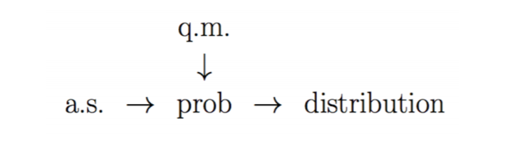

# Econometrics - TA Session 1

> Author: `Qinzhu Sun`
> Updated: `2021/3/17`

[toc]

## Programming

Let's wait and see what we can achieve today. Maybe next Tuesday.

## Something to say in Problem Set 1

1. Denote the subscript when you have multiple pdf: $f_X(x),f_Y(y),f_{XY}(x,y)$

2. It is better to write $\int_{x\in\Omega}$ (or simply $\int_X$) instead of $\int^\infty_{-\infty}$ if the support is not given.

3. Assign the **seed** beforehand when you do simulation. (very useful when you conduct research)

## Linear Algebra and derivatives

> $$\frac{\partial}{\partial\beta}\alpha'\beta=\alpha,\quad \frac{\partial}{\partial\beta} \beta'\alpha=\alpha$$
>
> $$\frac{\partial}{\partial\beta} \beta'A\beta=(A+A')\beta$$

### Why the following is correct?

$$(X'X)^{-1}X'\varepsilon = \sum_{i=1}^n(x_i'x_i)(\sum_{j=1}^nx_j\varepsilon_j) $$

Proof:

$$X'X=\begin{pmatrix}
    x_{11} & \cdots & x_{N1} \\
    \vdots &        & \vdots \\
    x_{1K} & \cdots & x_{NK}
\end{pmatrix}_{K\times N}
\begin{pmatrix}
    x_{11} & \cdots & x_{1K} \\
    \vdots &        & \vdots \\
    x_{N1} & \cdots & x_{NK}
\end{pmatrix}_{N\times K}
$$

$$\Rightarrow (X'_{K\times N}X_{N\times K})_{ij}=\sum_{n=1}^N (X')_{in}(X)_{nj}=\sum_{n=1}^N (X)_{ni}(X)_{nj}=\sum_{n=1}^N x_{ni}x_{nj} $$

The dimension of $N$ is absorbed through summation.

$$\sum_{i=1}^Nx_i'x_i=\sum_i\begin{pmatrix}
    x_{i1}\\\vdots\\x_{iK}
\end{pmatrix}(x_{i1},...,x_{iK})=\sum_i\begin{pmatrix}
    x_{i1}x_{i1} & \cdots & x_{i1}x_{iK}\\
    \vdots       &        & \vdots \\
    x_{iK}x_{i1} & \cdots & x_{iK}x_{iK}
\end{pmatrix} $$

$$\Rightarrow (\sum_{n=1}^Nx_n'x_n)_{ij}=\sum_{n=1}^Nx_{ni}x_{nj} $$

### Variance-Covariance Matrix

$$Var[X'\varepsilon]=E[X'\varepsilon(X'\varepsilon)']=E[X'\varepsilon\varepsilon'x] $$

## Proof for Chebyshev's Inequality

$$P\{|X|\geq \varepsilon\}\leq \frac {E{|X|^k}}{\varepsilon^k},\forall \varepsilon>0,\forall k>0.$$

Proof:

$$\qquad\bold 1\{|X|\geq\varepsilon\}\leq \left|\frac X\varepsilon \right|^k$$

$$\Rightarrow \quad P(\{|X|\geq\varepsilon\})=\bold E[1\{|X|\geq\varepsilon\}]\leq \frac {E|X|^k}{\varepsilon^k}$$

## Convergence Mode

The most important two convergence mode is $\overset{p}{\to}$ and $\overset{d}{\to}$.

> Q1: Is convergence in quadratic mean the same as convergence in probability?
>
> A1: No.

## LLN & CLT

### LLN: diff between them

#### The oldest version: Bernoulli LLN

$$P(X=1)=p, P(X=0)=1-p, $$

#### Weak LLN

$$\{x_i\}_{i=1}^n,x_i\overset{i.i.d}{\sim} \mathcal{F},\mu<\infty,\sigma^2<\infty,$$

$$\Rightarrow \bar{x}_n\overset{p}{\to}\mu$$

#### Khinchin's WLLN

$$\{x_i\}_{i=1}^n,x_i\overset{i.i.d}{\sim} \mathcal{F},\mu<\infty,$$

$$\Rightarrow \bar{x}_n\overset{p}{\to}\mu$$

#### Chebyshev's WLLN

$$\{x_i\}_{i=1}^n,E[x_i]=\mu_i<\infty,Var[x_i]=\sigma^2<\infty,\;still\;independent $$

Assume

$$\bar{\sigma}_n^2=n^{-1}\sum_i\sigma^2_i\overset{p\to\infty}{\to}0 $$

$$\Rightarrow \plim (\bar{x}_n-\bar{\mu}_n)=0$$

### CLT: def & diff

#### Lindeberg-Levy CLT

$$\{x_i\}_{i=1}^n,x_i\overset{i.i.d}{\sim} \mathcal{F},\mu<\infty,\sigma^2<\infty$$

$$\Rightarrow \sqrt{n}(\bar{x}_n-\mu) \overset{d}{\to}N(0,\sigma^2) $$

#### Lindeberg-Feller CLT

$$\{x_i\}_{i=1}^n,x_i\sim F(\mu_i,\sigma^2_i),\;still\;independent $$

Assume

$$\lim \frac{\max (\sigma^2_i)}{n\bar{\sigma}^2_n}=0, \lim\bar{\sigma}^2_n=\bar{\sigma}^2,$$

then

$$\sqrt{n}(\bar{x}_n-\mu) \overset{d}{\to}N(0,\bar{\sigma}^2_n) $$

## Why this course more mathematic than economic?
